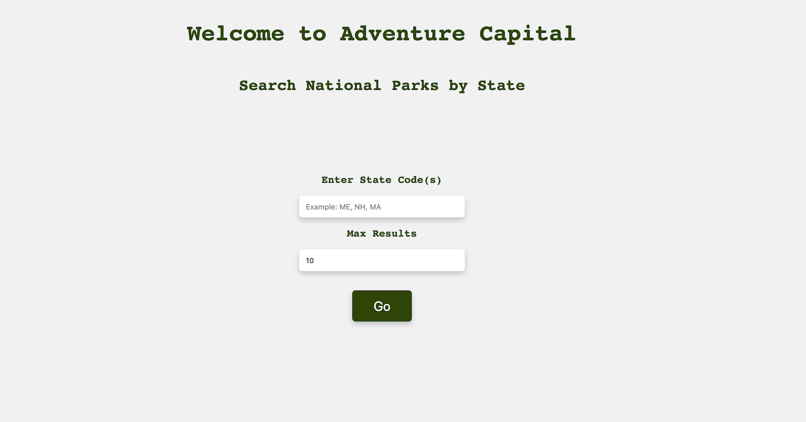
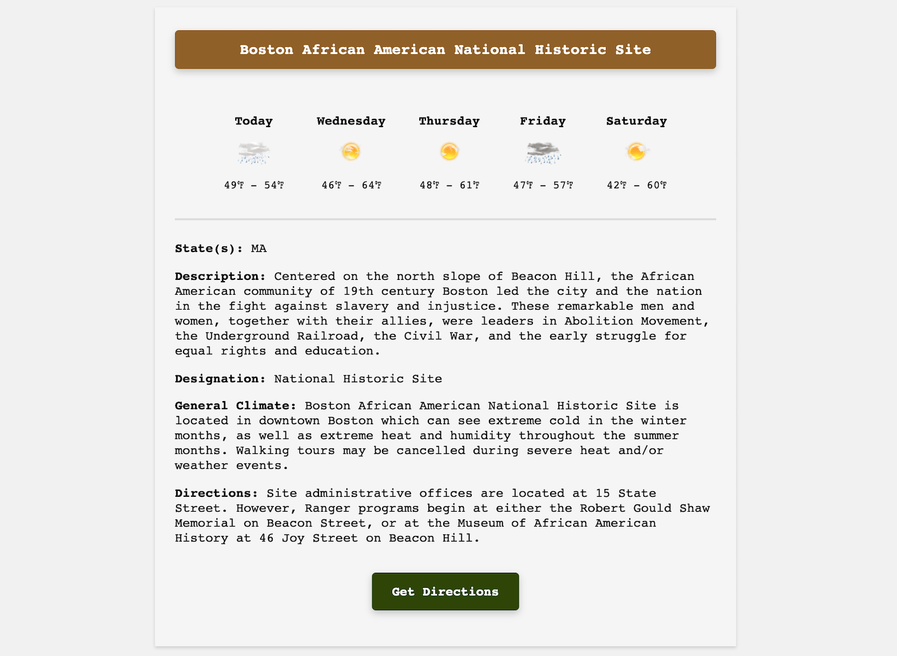

# Adventure Capital
#### *A web app that enables users to search for National Parks by state(s), and then to see relevant planning info, such as weather forecasts and directions, immediately on a single card.*

**Technologies**: HTML, CSS, Javascript, jQuery.

Click on a screenshot to check out the live app.

